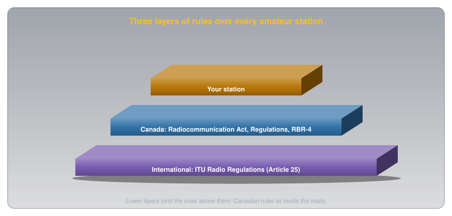

# Across Borders: Visitors, Third Parties, and Operating Abroad

!!! abstract "Beginner"
    This article is in the **Getting Licensed** topic, after [What You May Say](what_you_may_say.md). Covers Basic exam section B-001 (Regulations and Policies), topics B-001-014, B-001-020, and B-001-021.

Radio waves don't stop at borders. A Canadian station on 20 metres can reach Europe, Japan, and South America in one evening, and a Canadian with a handheld can drive across the border into Maine and keep talking. So amateur radio needs rules that work between countries: who you may talk to, who may talk through your station, and what happens to your certificate when you travel.

Two ideas cover all of it:

1. **Canadian rules sit inside an international treaty.** The International Telecommunication Union (ITU) Radio Regulations set the outer limits for every country's amateurs, and Canada's Act, Regulations, and RBR-4 work within them.
2. **Wherever a station is, that country's rules apply.** A visitor to Canada follows Canadian rules; a Canadian abroad follows the host's. Agreements between countries decide who may operate at all, and with what privileges.

The sources are RBR-4 (Issue 3, July 2022), RIC-3 (Issue 5, March 2022), the [Radiocommunication Regulations](https://laws-lois.justice.gc.ca/eng/regulations/SOR-96-484/FullText.html) (current to September 21, 2026), and Article 25 of the ITU Radio Regulations.

---

## Idea One: A Treaty Above the Act

The ITU is the United Nations agency for telecommunications, and its Radio Regulations are a treaty that Canada has signed. Canada's own law sits inside it. Section 6 of the [Radiocommunication Act](https://laws-lois.justice.gc.ca/eng/acts/r-2/FullText.html) lets the Governor in Council (the federal Cabinet) make the Regulations, section 45 of the Regulations brings in RBR-4, and Innovation, Science and Economic Development Canada (ISED) administers all of it.

<figure markdown>
  { width="760" }
  <figcaption>A Canadian amateur answers to both layers; the treaty sets the outer limits.</figcaption>
</figure>

Article 25 of the Radio Regulations is the amateur service's international rulebook. Four of its provisions come up on the exam:

- **25.1, contact is allowed by default:** "Radiocommunication between amateur stations of different countries shall be permitted unless the administration of one of the countries concerned has notified that it objects to such radiocommunications." If a country has filed an objection, you may not contact its amateurs.
- **25.2, what you may say internationally:** transmissions between amateur stations of different countries "shall be limited to communications incidental to the purposes of the amateur service" and "remarks of a personal character." That matches the Canadian rules in [What You May Say](what_you_may_say.md), applied across borders.
- **25.5, Morse code is each country's call:** "Administrations shall determine whether or not a person seeking a licence to operate an amateur station shall demonstrate the ability to send and receive texts in Morse code signals." Canada made it optional; some countries still require it.
- **25.9B, visitors are each country's call too:** an administration "may determine whether or not to permit a person who has been granted a licence to operate an amateur station by another administration to operate an amateur station while that person is temporarily in its territory."

### The Three ITU Regions

The treaty divides the world into three regions, each with its own frequency allocations. That's why amateur bands differ between continents: the 40-metre band, for example, runs from 7.000 to 7.300 MHz in Region 2 but stops at 7.200 MHz in Region 1 (RBR-4 Schedules II and III).

<figure markdown>
  { width="760" }
  <figcaption>Canada, the United States, and the rest of the Americas share Region 2.</figcaption>
</figure>

The boundaries aren't national borders but lines drawn on the globe, defined in Article 5 of the Radio Regulations (the United States reproduces them in [47 CFR 2.104](https://www.ecfr.gov/current/title-47/part-2/section-2.104)). Region 2 lies between a line running down the Atlantic and one running through the Bering Strait and down the Pacific.

The regions matter to a Canadian in one specific place. RBR-4 section 7 says an amateur station on a Canadian-registered ship or aircraft "operating in international waters or international airspace" may use the bands in Schedule II, III, or IV, the tables for Regions 1, 2, and 3. Anywhere else outside Canada, the host country's rules apply.

---

## Third Parties

A **third party** is someone without an amateur certificate who takes part in a contact. If your uncertified friend speaks through your station to an amateur in England, your friend is a third party; if that amateur's uncertified friend joins in, both friends are third parties.

<figure markdown>
  { width="760" }
  <figcaption>The operators are amateurs; everyone else on the link is a third party.</figcaption>
</figure>

The ITU starting point, No. 25.3, is strict: international third-party messages only "in case of emergencies or disaster relief." But it lets each country decide: "An administration may determine the applicability of this provision to amateur stations under its jurisdiction." Canada decided generously. RBR-4 section 6, in full:

> Any foreign administration may permit its amateur stations to communicate on behalf of third parties without having to enter into any special arrangements with Canada. Canada does not prohibit international communications on behalf of third parties. In cases of emergencies or disaster relief, international third-party communications are expressly permitted unless specifically prohibited by a foreign administration.

So from Canada's side, third-party traffic is allowed with any amateur station. The other country's rules govern its end: the United States, for example, allows it only with countries that have an arrangement with it, or in emergencies ([47 CFR 97.115](https://www.ecfr.gov/current/title-47/part-97/section-97.115)). Two Canadian rules still apply. The content must be personal and non-commercial, as section 47 of the Regulations requires, and the certificate holder stays in control and supervises, as section 46 does. If a foreign station breaks in to talk to your friend, nothing requires you to end it; you keep monitoring, because you're responsible for what your station sends.

---

## Idea Two: Visitors to Canada

Section 42 of the Regulations lists who may operate in the amateur service. Besides Canadian certificate holders, it includes two kinds of visitor: a holder of a United States amateur licence who is a United States citizen, and a citizen of another country holding that country's amateur authorization, if "a reciprocal arrangement that allows similar privileges to Canadians exists between that other country and Canada."

<figure markdown>
  ![Three kinds of visitor operating in Canada. From the United States: no permit is needed; they use their FCC call sign plus "portable" or "mobile" and the Canadian prefix for where they are, under RBR-4 section 9, and must be United States citizens. With a CEPT licence: privileges equal to a Canadian with Basic and Advanced, under RIC-3 section 8.2.1, but no more than their own licence. From other countries: they must be citizens of the issuing country, which must give Canadians similar privileges, under section 42(i) of the Regulations.](images/across_borders/visitors.svg){ width="760" }
  <figcaption>Every visitor follows Canadian rules while in Canada.</figcaption>
</figure>

- **From the United States.** A treaty from 1952 covers amateurs crossing the border either way ([RIC-3](https://ised-isde.canada.ca/site/spectrum-management-telecommunications/en/licences-and-certificates/radiocom-information-circulars-ric/ric-3-information-amateur-radio-service) section 8.1). "Visiting amateurs are not required to register or receive a permit," but each station "shall indicate its geographical location as nearly as possible by city and state or city and province at least once during each contact." The visitor identifies with their Federal Communications Commission (FCC) call sign, the word "mobile" or "portable," and the Canadian prefix for where they are, as [What You May Transmit](what_you_may_transmit.md#idea-two-every-transmission-says-who-sent-it) covers.
- **With a European licence.** The European Conference of Postal and Telecommunications Administrations (CEPT) runs a licensing system, Recommendation T/R 61-01, that lets amateurs from participating countries operate in each other's territory. Canada participates. RIC-3: "A foreign amateur with a CEPT T/R 61-01 licence who is visiting Canada will have operating privileges equivalent to a Canadian with an Amateur Radio Operator Certificate with both Basic Qualification and Advanced Qualification."
- **From elsewhere.** Other countries' amateurs need a reciprocal arrangement and must hold their home country's citizenship. RBR-4 section 3.2 sets the ceiling for every authorized foreign amateur: Canadian Basic-plus-Advanced privileges, "but not exceeding the privileges of the amateur radio licence granted to them by their own administration."

---

## Operating Abroad

Going the other way, RBR-4 section 7 puts it plainly: amateurs outside Canada "are subject to the rule of the jurisdiction in which they are operating and are responsible for seeking any needed authorities from the regulatory body for that jurisdiction." Canada has three standing arrangements that make that easier.

<figure markdown>
  ![Four destinations for a Canadian operating abroad. United States: Basic is enough, no permit, carry your certificate, United States band edges and mode rules apply, and you identify with your call sign followed by portable and the United States call area. CEPT countries: Basic plus Advanced, a permit from Radio Amateurs of Canada, the host country's rules, and identification with the host prefix, then stroke and your call sign. IARP countries in the Americas: Basic, a permit from Radio Amateurs of Canada; Class 2 for Basic covers bands above 30 megahertz only, and Class 1 needs Morse code at 12 words per minute. Anywhere else: contact that country's administration well in advance.](images/across_borders/abroad.svg){ width="760" }
  <figcaption>The minimum qualification and the paperwork depend on where you're going.</figcaption>
</figure>

- **The United States.** Basic is enough and no permit is needed. RIC-3: "Canadian amateurs operating in the U.S. have the same privileges as they have in Canada, and are limited by U.S. band edges and mode restrictions." The FCC requires a Canadian to put the United States call-area indicator after the call sign ([47 CFR 97.119(g)](https://www.ecfr.gov/current/title-47/part-97/section-97.119)). By voice, that's your call sign, "portable" or "mobile," then the United States call area, plus your location by city and state at least once per contact. That applies offshore too: a station 7 kilometres off Florida is inside United States territorial waters, which extend 12 nautical miles (about 22 kilometres) from the coast under the [United Nations Convention on the Law of the Sea](https://www.un.org/depts/los/convention_agreements/texts/unclos/unclos_e.pdf), Article 3, so United States band limits apply.
- **CEPT countries.** A permit under T/R 61-01 lets you operate in participating countries, mostly in Europe. RIC-3 requires both Basic and Advanced, with your call sign on your certificate, and Radio Amateurs of Canada (RAC) issues the permits on ISED's behalf. You identify with the host country's prefix, a stroke, then your call sign: in the United Kingdom, a Canadian whose call sign is the made-up VA1XYZ would send "M/VA1XYZ."
- **International Amateur Radio Permit (IARP) countries.** The IARP comes from an Inter-American convention among countries of the Organization of American States. RAC issues it in two classes. Class 2, for holders of Basic, covers "all the amateur allocations above 30 MHz." Class 1, which RIC-3 lists for Basic with Morse Code (12 w.p.m.), adds every amateur band.
- **Anywhere else.** Contact the country's administration "well in advance," as RIC-3 puts it, and follow whatever conditions it sets.

A permit issued for travel "has no legal status in Canada," RIC-3 notes for both CEPT and IARP. At home, your certificate is what counts.

---

## Common Misconceptions

- **"Third-party traffic needs a special treaty."** Not from Canada's side (RBR-4 section 6). The other country decides for its end.
- **"My Basic certificate lets me operate anywhere in Europe."** CEPT permits need Basic and Advanced.
- **"In the United States, I keep my Canadian bands."** You keep your Canadian privileges, but inside United States band edges and mode rules.
- **"Visitors to Canada get whatever their home licence allows."** They get their home privileges, capped at Canadian Basic plus Advanced.

---

## Practice

??? question "1. The Friend at the Microphone"

    Your uncertified friend is talking through your station to a station in another country, under your supervision. A second foreign station breaks in to talk to your friend. What should you do?

    ??? tip "Solution"
        **Keep monitoring.** Canada doesn't prohibit international third-party traffic (RBR-4 section 6), and you stay responsible for your station (Regulations section 46).

??? question "2. Who's the Third Party?"

    You and a foreign amateur each have an uncertified friend taking part in the contact. Who are the third parties?

    ??? tip "Solution"
        **Both uncertified friends.** A third party is anyone in the contact without an amateur authorization.

??? question "3. A Country That Objects"

    When may a Canadian station not contact amateurs in another country?

    ??? tip "Solution"
        When that country has notified the ITU that it objects to such radiocommunications (Radio Regulations No. 25.1).

??? question "4. A Week in Florida"

    You hold Basic. May you operate on a trip to Florida, and under whose band limits?

    ??? tip "Solution"
        **Yes, with no permit.** Your Canadian privileges apply, limited by United States band edges and mode rules (RIC-3 section 8.1).

??? question "5. A Trip to France"

    You hold Basic with Honours. Can you get a CEPT permit for France?

    ??? tip "Solution"
        **No.** RIC-3 requires both Basic and Advanced for a CEPT T/R 61-01 permit.

??? question "6. A Visitor From Germany"

    A German amateur with a CEPT licence visits Nova Scotia. What privileges do they have?

    ??? tip "Solution"
        Those of a Canadian with **Basic and Advanced**, but no more than their own licence allows (RIC-3 section 8.2.1; RBR-4 section 3.2).

---

## Quick Recap

-   **A treaty above the Act**

    ---

    The ITU Radio Regulations bind Canada; ISED administers the Act, Regulations, and RBR-4 inside them.

-   **Article 25**

    ---

    International contacts are allowed unless a country objects. Content limited to amateur purposes and personal remarks. Each country decides on Morse and on visitors.

-   **Three regions**

    ---

    Region 1: Europe, Africa, the Middle East, the former Soviet Union. Region 2: the Americas, including Canada. Region 3: the rest of Asia and Oceania.

-   **Third parties**

    ---

    Canada allows international third-party traffic with any station. The other country decides for its end. Emergencies: expressly permitted unless a foreign administration prohibits it.

-   **Visitors to Canada**

    ---

    Americans: no permit, own call sign plus "portable" and the Canadian prefix. CEPT holders: Basic plus Advanced privileges. Others: a reciprocal arrangement and home citizenship.

-   **Canadians abroad**

    ---

    United States: Basic, no permit, United States band edges. CEPT: Basic plus Advanced. IARP: Basic, above 30 MHz for Class 2. Elsewhere: ask first.

-   **On the exam**

    ---

    Canada is in Region 2; Europe and Africa are Region 1; Australia, Japan, and Southeast Asia are Region 3. In the United States you follow United States band limits, including 7 km offshore. CEPT needs Advanced; identify as host prefix, "stroke," your call sign. In the United States, your call sign, "portable" or "mobile," then the United States call area. Americans in Canada give their location by city and province at least once per contact. Third-party traffic: personal and non-commercial only.

---

## What's Next

Every rule so far has an enforcer behind it. [Who Enforces the Rules](who_enforces_the_rules.md) covers where the rules come from, what a radio inspector may and may not do, and the two routes to a penalty.

---

## Further Reading

**Regulations**

- [RBR-4](https://ised-isde.canada.ca/site/spectrum-management-telecommunications/en/licences-and-certificates/regulations-reference-rbr/rbr-4-standards-operation-radio-stations-amateur-radio-service) — sections 3.2 (foreign equivalencies), 6 (third parties), 7 (operation outside Canada), 9 (identification by United States licensees)
- [RIC-3: Information on the Amateur Radio Service](https://ised-isde.canada.ca/site/spectrum-management-telecommunications/en/licences-and-certificates/radiocom-information-circulars-ric/ric-3-information-amateur-radio-service) — section 8, reciprocal agreements, CEPT, IARP, and third parties
- [Radiocommunication Regulations](https://laws-lois.justice.gc.ca/eng/regulations/SOR-96-484/FullText.html) — section 42, who may operate in the amateur service
- [ITU Radio Regulations, 2024 Edition (PDF)](https://www.itu.int/dms_pub/itu-r/oth/0C/0A/R0C0A0000110086PDFE.pdf) — Article 5 (regions) and Article 25 (amateur services)
- [47 CFR 97.107](https://www.ecfr.gov/current/title-47/part-97/section-97.107) and [97.119](https://www.ecfr.gov/current/title-47/part-97/section-97.119) — the United States rules for Canadians operating there

**Practical**

- [Radio Amateurs of Canada: Operating Internationally](https://rac.ca/operating/operating-internationally/) — applying for CEPT and IARP permits

**Related Articles**

- [What You May Say: Content, Control, and Emergencies](what_you_may_say.md) — the content rules that apply to international contacts too
- [What You May Transmit: Bands, Power, and Identification](what_you_may_transmit.md) — Canadian bands and how visitors identify
- [The Amateur's Code](amateurs_code.md) — conduct on the air
