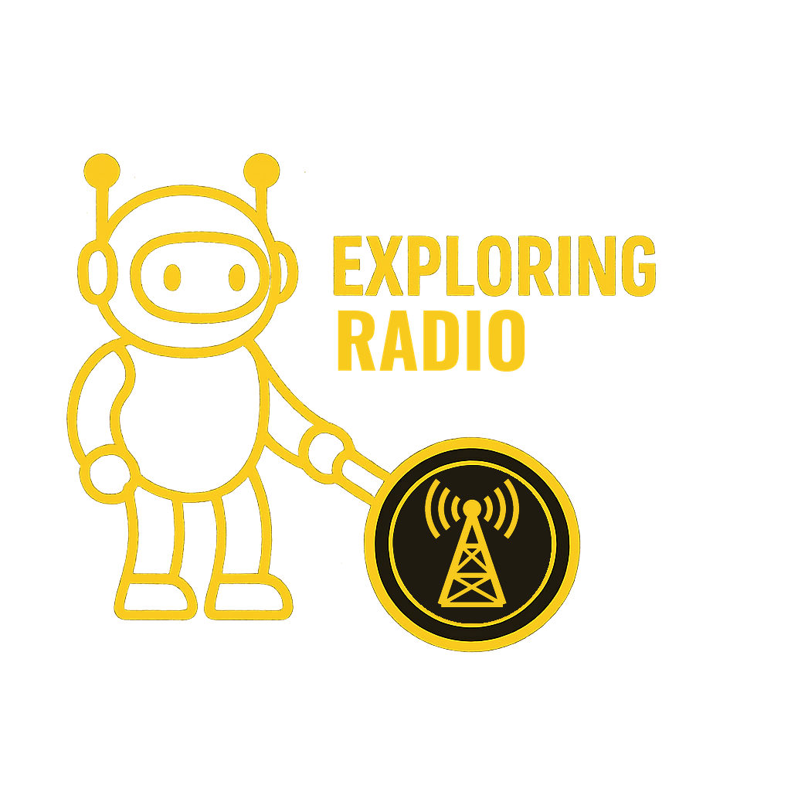

# Exploring Radio

When the cell towers go quiet in a storm, a ten-dollar wire antenna and a licensed operator can still reach across the province. Amateur radio is the one hobby where ordinary people are trusted to build, tune, and transmit on real radio spectrum. That trust comes with an exam.

This site teaches amateur radio from first principles, starting with the Canadian Amateur Radio Operator Certificate and going on to antennas, propagation, and making real contacts. The aim is to understand why the physics and the rules are the way they are, not to memorise a question bank.

## Who This Is For

Anyone in Canada who wants to get on the air: emergency-communications volunteers, outdoors people, makers, retirees, and the technically curious. No electronics or radio background is assumed. If you're studying for the Basic Qualification exam, the site is built around its syllabus.

## How It's Organised

Articles are grouped into **topics**, each of which maps to sections of the Basic Qualification exam. Every article carries a difficulty tag (Beginner, Intermediate, Advanced) and names the exam section it covers, so you can study in the exam's own terms.

-   :material-stairs: **Start here**

    ---

    Radio is electricity that reverses millions of times a second. [Start Here](start_here.md) lists the electricity to learn first, in order, and which exam topics each piece covers.

-   :material-certificate: **Studying for the exam?**

    ---

    The Basic exam is 100 questions. A pass is 70%, and 80% earns Honours, which opens the HF bands below 30 MHz. [Getting Your Certificate](getting_your_certificate.md) covers the whole route; the topics below follow the exam's eight sections.

-   :material-headphones: **Not licensed yet?**

    ---

    Listening needs no certificate. The receiver projects here are the best way to learn what the bands sound like before you ever transmit.

---

## Topics

The seven topics below are being written. Each one will appear here as its first article is published.

- **Getting Licensed**: the certificate, the exam, call signs, and what each qualification lets you do. [Explore Getting Licensed](getting_licensed.md): how to get your certificate and what it lets you transmit
- **Radio Fundamentals**: frequency, wavelength, resonance, decibels, and modulation. [Explore Radio Fundamentals](radio_fundamentals.md): radio waves, the spectrum, and decibels
- **Antennas & Feedlines**: dipoles, verticals, coax, and standing wave ratio
- **Propagation**: how signals travel, from line of sight to bouncing off the ionosphere
- **On the Air**: repeaters, simplex, phonetics, and making your first contact. Start with [The Amateur's Code](amateurs_code.md), the two short codes of conduct every operator is expected to follow
- **Station & Safety**: power, grounding, lightning, RF exposure, and interference
- **Digital Modes & SDR**: FT8, APRS, and software-defined radio receivers

## Practical Tools

- [ISED Basic Qualification Anki Deck](tools/ised_basic_anki_deck.md) — all 984 exam-bank questions as a free spaced-repetition deck, organized by exam section

## Part of the BradPenney.io Network

This site is part of a family of progressive technical learning resources:

- [Exploring Electronics](https://electronics.bradpenney.io) — Electronics and physical computing from first principles (the circuit theory behind radio lives here)
- [Exploring CNC](https://cnc.bradpenney.io) — Hobby CNC machining with an open-source workflow
- [Exploring Linux](https://linux.bradpenney.io) — Linux for developers and platform engineers
- [Exploring Computer Science](https://cs.bradpenney.io) — CS theory for working engineers

## Subscribe by RSS

New articles publish straight to the [RSS feed](https://radio.bradpenney.io/feed_rss_created.xml), with no algorithm and no email required.

