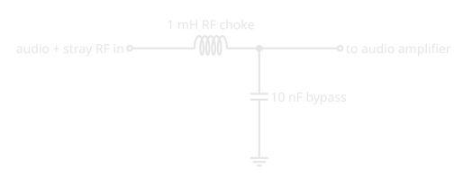

# Reactance and Impedance: How Coils and Capacitors Treat Each Frequency

!!! abstract "Beginner"
    The third article in the **[Radio Fundamentals](radio_fundamentals.md)** topic, after [Decibels](decibels.md). Covers Basic exam section B-005 (Basic Electronics and Theory), topic B-005-010.

A microphone cable picks up your own transmitter and the audio starts to buzz. You clip a ferrite core around the cable and the buzz is gone, while your voice comes through exactly as before. The ferrite didn't know which signal was which. It just treats different frequencies very differently, and so does every coil and capacitor in a radio.

Two ideas explain it:

1. **Reactance is opposition that depends on frequency.** It's measured in ohms like resistance, but an inductor's reactance rises with frequency and a capacitor's falls. At audio and at radio frequencies, the same part can be thousands of times apart.
2. **Impedance is the total opposition to AC.** It's the ratio of AC voltage to AC current, and it combines resistance and reactance, though not by simple addition.

[Capacitors](https://electronics.bradpenney.io/capacitors/) and [Inductors](https://electronics.bradpenney.io/inductors/) on Exploring Electronics explain *why* each one's opposition moves with frequency. This article puts numbers on it.

---

## Idea One: Reactance, in Ohms

Reactance has the symbol *X* and is measured in ohms. For an inductor of *L* henries and a capacitor of *C* farads, at a frequency of *f* hertz:

$$
X_L = 2\pi f L \qquad\qquad X_C = \frac{1}{2\pi f C}
$$

- **Inductive reactance rises with frequency.** *f* is on top: double the frequency and the reactance doubles. A coil is nearly a short circuit to DC and low frequencies and a growing obstacle as the frequency climbs.
- **Capacitive reactance falls with frequency.** *f* is underneath: double the frequency and the reactance halves. A capacitor blocks DC, resists low frequencies, and passes high ones easily. Put the other way, its reactance increases as the frequency decreases.

<figure markdown>
  { width="760" }
  <figcaption>Ten times the frequency: ten times the coil's reactance, a tenth of the capacitor's.</figcaption>
</figure>

Two ordinary parts, at an audio frequency and at a 40 m frequency:

| Part | At 1 kHz (audio) | At 7 MHz (40 m) |
|---|---|---|
| 1 mH inductor | \(2\pi \times 1{,}000 \times 0.001\) ≈ 6.3 Ω | \(2\pi \times 7{,}000{,}000 \times 0.001\) ≈ 44,000 Ω |
| 10 nF capacitor | ≈ 15,900 Ω | ≈ 2.3 Ω |

Seven thousand times the frequency means seven thousand times the coil's reactance, and one seven-thousandth of the capacitor's. That enormous swing is what makes both parts useful.

Reactance also differs from resistance in where the energy goes. A resistor turns energy into heat. An ideal coil or capacitor stores energy for part of each cycle, in a magnetic or electric field, and hands it back in the next. So reactance limits AC current without wasting power.

---

## Putting Reactance to Work: Chokes and Bypass Capacitors

The ferrite on the microphone cable, and its partner the bypass capacitor, use exactly those numbers.

<figure markdown>
  { width="560" }
  <figcaption>A series choke and a capacitor to ground: the classic RF filter on an audio or power lead.</figcaption>
</figure>

- **The RF choke, in series.** A coil, or a ferrite core around a cable, which acts as a coil of one turn, has **high reactance at radio frequencies**, so it blocks RF trying to travel along the lead. It has **low reactance at low frequencies**, so the audio or DC meant to flow through it passes almost untouched.
- **The bypass capacitor, to ground.** It has **low reactance at radio frequencies**, so any RF that reaches it takes the easy path to ground instead of continuing into the amplifier. It has **high reactance at audio frequencies**, so it has little effect on the audio, which carries on to the amplifier.

<figure markdown>
  { width="760" }
  <figcaption>Same parts, opposite roles: each frequency sees a different circuit.</figcaption>
</figure>

The same pair turns up all over a station: on power leads, on speaker and microphone lines, and inside equipment, keeping RF where it belongs.

---

## Idea Two: Impedance, the Total Opposition

Most real circuits have resistance and reactance together: a coil has the resistance of its wire, an antenna has both. **Impedance**, symbol *Z*, is the total opposition to alternating current, and it's defined the same way resistance is in [Ohm's law](https://electronics.bradpenney.io/ohms_law/): the ratio of AC voltage to AC current.

$$
Z = \frac{V}{I}
$$

Resistance and reactance don't simply add, though. In a reactance, the current is a quarter-cycle out of step with the voltage: it lags behind in an inductor and leads in a capacitor. In a resistance they're in step. So the two combine at right angles, like the sides of a right triangle, and for a resistance and a reactance in series:

$$
Z = \sqrt{R^2 + X^2}
$$

<figure markdown>
  { width="760" }
  <figcaption>30 Ω of resistance and 40 Ω of reactance make 50 Ω of impedance, not 70.</figcaption>
</figure>

Impedance is the number radio equipment is built around. Most amateur transceivers are designed to deliver their power into 50 Ω, and common coaxial cable is made to match. Getting an antenna system to look like 50 Ω to the transmitter is a large part of what antennas and feedlines are about.

---

## Common Misconceptions

- **"A capacitor's reactance rises with frequency."** It falls. The inductor's rises.
- **"Reactance burns power like resistance."** An ideal reactance stores and returns energy; only resistance turns it into heat.
- **"Impedance is resistance plus reactance."** They combine at right angles: √(R² + X²).
- **"A choke blocks everything."** It blocks high frequencies; DC and audio pass straight through.

---

## Practice

??? question "1. Coil and Frequency"

    How does an inductor's reactance change as the frequency of the applied AC increases?

    ??? tip "Solution"
        It **increases**. XL = 2πfL, with *f* on top.

??? question "2. Capacitor and Frequency"

    When does a capacitor's reactance increase?

    ??? tip "Solution"
        As the **frequency decreases**. XC = 1 ÷ 2πfC, with *f* underneath.

??? question "3. The Ferrite Core"

    What property lets a ferrite core on a cable stop an interfering radio signal?

    ??? tip "Solution"
        Its **high reactance at radio frequencies**.

??? question "4. The Bypass Capacitor"

    Why does an RF bypass capacitor across an audio line have little effect on the audio?

    ??? tip "Solution"
        Its **reactance is high at audio frequencies**, so audio doesn't flow through it to ground. At RF its reactance is low, so it diverts the RF.

??? question "5. Voltage over Current"

    What term is the ratio of AC voltage to AC current in a circuit?

    ??? tip "Solution"
        **Impedance.**

??? question "6. Combining"

    A circuit has 30 Ω of resistance in series with 40 Ω of reactance. What's its impedance?

    ??? tip "Solution"
        √(30² + 40²) = √2,500 = **50 Ω**.

---

## Quick Recap

-   **Reactance**

    ---

    Frequency-dependent opposition to AC, in ohms. Stores energy and returns it; wastes none.

-   **Inductors**

    ---

    XL = 2πfL. Rises with frequency: passes DC and audio, resists RF.

-   **Capacitors**

    ---

    XC = 1 ÷ 2πfC. Falls with frequency: blocks DC, passes RF.

-   **Chokes and bypasses**

    ---

    A series choke blocks RF; a capacitor to ground shunts it. Both leave audio alone.

-   **Impedance**

    ---

    Total opposition to AC: Z = V ÷ I. Resistance and reactance combine as √(R² + X²).

-   **On the exam**

    ---

    An inductor's reactance increases with frequency; a capacitor's decreases, and increases as frequency decreases. Impedance is the combined opposition of resistance and reactance, and the ratio of AC voltage to AC current. A ferrite coil works by high reactance at RF; an RF bypass capacitor diverts RF by low reactance at RF and leaves audio alone by high reactance at audio; an RF choke passes wanted signals by low reactance at low frequencies.

---

## What's Next

The two lines on the graph cross: at one frequency, the coil's reactance exactly equals the capacitor's. That crossing is resonance, the reason a radio can pick one station out of thousands: [Resonance and Tuned Circuits](resonance.md).

---

## Further Reading

**On Exploring Electronics**

- [Capacitors](https://electronics.bradpenney.io/capacitors/) — why a capacitor's opposition to AC falls with frequency
- [Inductors](https://electronics.bradpenney.io/inductors/) — why a coil's rises, and what chokes are for
- [Ohm's Law and Power](https://electronics.bradpenney.io/ohms_law/) — the voltage-over-current ratio that impedance extends

**Related Articles**

- [Decibels: Ratios You Can Add](decibels.md) — the previous article in Radio Fundamentals
- [What Is a Radio Wave?](what_is_a_radio_wave.md) — frequency, the variable everything here depends on
