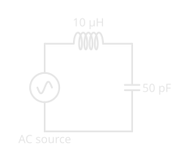
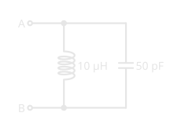

# Resonance and Tuned Circuits: Picking One Frequency Out of Thousands

!!! abstract "Beginner"
    The fourth article in the **[Radio Fundamentals](radio_fundamentals.md)** topic, after [Reactance and Impedance](reactance_and_impedance.md). Covers Basic exam section B-005 (Basic Electronics and Theory), topic B-005-012, and the trap question in B-006-008.

An antenna delivers every signal it can catch to the receiver at once: broadcast stations, amateurs on every band, lightning crashes from three provinces away. Turning the tuning knob picks one of them and makes the rest disappear. The part doing the picking is usually just a coil and a capacitor.

Two ideas explain how:

1. **Resonance is where a coil's reactance equals a capacitor's.** One rises with frequency and the other falls, so there's exactly one frequency where they're equal. There, they cancel each other out.
2. **How the parts are connected decides what resonance does.** In series, a tuned circuit has its *lowest* impedance at resonance and passes that frequency; in parallel, its *highest*, and blocks it. Either way, resistance sets how wide a range of frequencies it responds to.

This builds directly on [Reactance and Impedance](reactance_and_impedance.md), where the two reactance lines cross.

---

## Idea One: Where the Reactances Meet

An inductor's reactance rises with frequency; a capacitor's falls. Plot both and the lines cross at one point. That frequency is the **resonant frequency**, and **resonance** is the condition where the inductive reactance and capacitive reactance are equal.

<figure markdown>
  { width="760" }
  <figcaption>A 10 µH coil and a 50 pF capacitor resonate in the 40 m band.</figcaption>
</figure>

They don't just match; they cancel. In a coil the current lags the voltage by a quarter-cycle, and in a capacitor it leads by a quarter-cycle, so their effects pull in exactly opposite directions. Engineers write inductive reactance as positive and capacitive reactance as negative, which is why the exam also describes resonance as the reactances being "equal and opposite in sign." At resonance their sum is zero, and only the circuit's resistance is left.

Setting 2πfL equal to 1 ÷ 2πfC and solving for *f* gives the resonant frequency:

$$
f = \frac{1}{2\pi\sqrt{LC}}
$$

For a 10 µH coil and a 50 pF capacitor, that's 7.12 MHz, where each reactance is about 447 Ω. Three things follow from the formula:

- **It takes both parts.** A tuned circuit needs an inductor and a capacitor; neither alone resonates.
- **Changing either part retunes it.** *L* and *C* are under a square root, so it takes four times the capacitance to halve the frequency: 200 pF with the same coil tunes 3.56 MHz, and 12.5 pF tunes 14.2 MHz. A tuning knob turning a variable capacitor is doing exactly this.
- **Resistance doesn't move it.** *R* isn't in the formula. Adding a resistor to a tuned circuit leaves the resonant frequency where it was, though it changes how sharply the circuit responds.

---

## Idea Two: Series or Parallel

The same coil and capacitor behave in opposite ways depending on how they're connected.

<figure markdown>
  { width="320" } { width="320" }
  <figcaption>Series (left): one path through both parts. Parallel (right): two paths side by side.</figcaption>
</figure>

- **Series: lowest impedance.** With the coil and capacitor in series, the current has to go through both. At resonance their reactances cancel, so the impedance falls to just the resistance of the circuit, and the **current reaches its maximum**. A series tuned circuit passes its resonant frequency and resists the rest.
- **Parallel: highest impedance.** With the coil and capacitor side by side, the same cancellation works the other way. At resonance, energy sloshes back and forth between the coil's magnetic field and the capacitor's electric field, and very little current needs to flow in from outside. To the circuit feeding it, a parallel tuned circuit, often called a **tank**, looks like a very **high impedance** at its resonant frequency.

<figure markdown>
  { width="760" }
  <figcaption>The same two parts: a sharp dip in series, a sharp peak in parallel.</figcaption>
</figure>

### Bandwidth

A tuned circuit has one resonant frequency, but it responds significantly over a range around it. That range is its **bandwidth**, usually measured between the points where the response has fallen to half power: −3 dB, as [Decibels](decibels.md) explains.

<figure markdown>
  { width="760" }
  <figcaption>Ten times the resistance, ten times the bandwidth, same centre.</figcaption>
</figure>

Resistance sets the width. The sharpness is called the circuit's **Q**, its quality factor: for a series circuit, the reactance at resonance divided by the resistance. With 5 Ω of resistance, Q is about 447 ÷ 5 ≈ 89 and the bandwidth about 7.12 MHz ÷ 89 ≈ 80 kHz. With 50 Ω, Q drops to about 9 and the bandwidth grows to about 800 kHz. A receiver wants a narrow response to separate stations; a circuit that has to cover a whole band wants a broader one.

---

## Where Tuned Circuits Work

- **Selecting a signal.** A receiver's resonant circuits select the desired signal frequency and reject the others. Each stage of tuning narrows the field further.
- **Traps on antennas.** A **trap** is a coil and capacitor in parallel, placed partway along an antenna wire. On its resonant frequency it's a very high impedance, so it cuts off the wire beyond it; on lower frequencies it passes the current on. One antenna, two bands.

<figure markdown>
  { width="760" }
  <figcaption>The trap's parallel resonance switches the outer wire in and out by frequency.</figcaption>
</figure>

- **The antenna itself.** A wire antenna has inductance and capacitance spread along its length, so it resonates too. Like any tuned circuit, it resonates lower if you add to it: a longer wire, or a coil in series, lowers its resonant frequency, and shortening it raises the frequency. The starting length comes from the wavelength, as [What Is a Radio Wave?](what_is_a_radio_wave.md) shows.

---

## Common Misconceptions

- **"At resonance the reactances add up."** They cancel: equal in size, opposite in sign.
- **"Every tuned circuit has low impedance at resonance."** Only series circuits. Parallel circuits have high impedance.
- **"A resistor shifts the resonant frequency."** It widens the bandwidth; the frequency stays put.
- **"Double the capacitance, halve the frequency."** It takes four times the capacitance, because of the square root.

---

## Practice

??? question "1. The Condition"

    What condition defines resonance?

    ??? tip "Solution"
        **Inductive reactance and capacitive reactance are equal** (and opposite in sign, so they cancel).

??? question "2. The Parts"

    What two components are needed to make a tuned circuit?

    ??? tip "Solution"
        An **inductor and a capacitor**.

??? question "3. Parallel at Resonance"

    What impedance does a parallel tuned circuit present at resonance?

    ??? tip "Solution"
        **High impedance.**

??? question "4. Series at Resonance"

    What happens to the current in a series RLC circuit tuned to the source's frequency?

    ??? tip "Solution"
        It **reaches its maximum**, because the impedance is at its lowest.

??? question "5. Adding Resistance"

    You add a resistor to a resonant circuit. What happens to the resonant frequency?

    ??? tip "Solution"
        **Nothing.** Resistance isn't in the formula; it only widens the bandwidth.

??? question "6. The Trap"

    What is an antenna trap made of?

    ??? tip "Solution"
        **A coil and a capacitor in parallel.**

---

## Quick Recap

-   **Resonance**

    ---

    XL = XC: equal and opposite, so they cancel. f = 1 ÷ 2π√(LC).

-   **Retuning**

    ---

    Change L or C to move the frequency; four times the C halves it. Resistance doesn't move it.

-   **Series**

    ---

    Lowest impedance and greatest current at resonance: passes the frequency.

-   **Parallel**

    ---

    Highest impedance at resonance: a tank, used as a trap or a filter.

-   **Bandwidth**

    ---

    The range of frequencies the circuit responds to, between the half-power points. More resistance, lower Q, wider bandwidth.

-   **On the exam**

    ---

    Resonance: XL and XC equal (and opposite in sign). A tuned circuit needs an inductor and a capacitor. Parallel at resonance: high impedance, and the resonant frequency is where its impedance is highest. Series at resonance: low impedance, maximum current. The range around resonance is the bandwidth. Adding a resistor doesn't change the resonant frequency. Receivers use resonant circuits to select signals. A trap is a coil and capacitor in parallel.

---

## What's Next

With resonance, every radio-specific topic in the exam's B-005 section is covered: frequency, decibels, reactance, and tuned circuits. [Radio Fundamentals](radio_fundamentals.md) lists every article in this topic, and [Start Here](start_here.md) maps the electricity they build on.

---

## Further Reading

**Related Articles**

- [Reactance and Impedance: How Coils and Capacitors Treat Each Frequency](reactance_and_impedance.md) — the two reactances that resonance balances
- [Decibels: Ratios You Can Add](decibels.md) — the half-power (−3 dB) points that define bandwidth
- [What Is a Radio Wave?](what_is_a_radio_wave.md) — wavelength, the starting point for an antenna's resonant length

**On Exploring Electronics**

- [Capacitors](https://electronics.bradpenney.io/capacitors/) and [Inductors](https://electronics.bradpenney.io/inductors/) — the two halves of every tuned circuit
