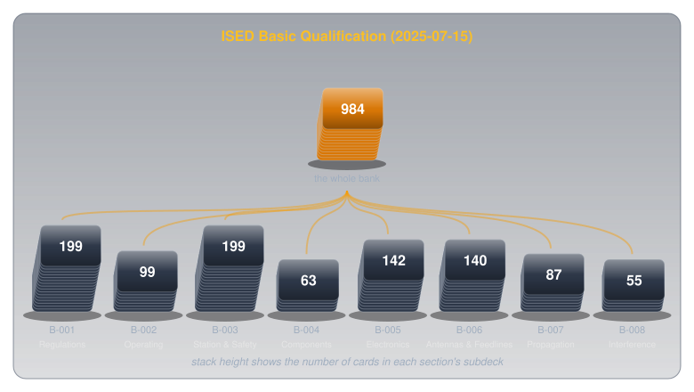

# ISED Basic Qualification Anki Deck

!!! abstract "Study tool"
    All 984 questions from ISED's Basic Qualification question bank (15 July 2025 edition), as a free Anki deck. Covers all eight Basic exam sections, B-001 to B-008.

Every question on the Canadian Basic Qualification exam comes from one public question bank, published by Innovation, Science and Economic Development Canada (ISED). The bank holds 984 questions, and each exam draws 100 of them. That makes the bank a natural fit for **spaced repetition**: a review method that shows each card again just before you would forget it, so study time goes to the questions that are still shaky.

This deck puts the whole bank into [Anki](https://apps.ankiweb.net/), the free, open-source spaced-repetition app. It's a drill for recall, and it works best alongside real understanding (see [How to Use It Well](#how-to-use-it-well) below).

-   :material-download: **Download the deck**

    ---

    `ised_basic_qualification_2025-07-15.apkg` · 984 cards · 631 KB

    [:octicons-download-24: Download for Anki](../downloads/ised_basic_qualification_2025-07-15.apkg){ .md-button .md-button--primary download }

---

## What the Exam Draws From the Bank

The bank's size is misleading until you see how the exam is assembled. ISED's RIC-3 divides the syllabus into 100 numbered **topic areas**, and every exam takes exactly **one question from each**. A section's weight on the exam is its number of topic areas, not its number of bank questions:

<figure markdown>
  { width="740" }
  <figcaption>Each column is one section's share of a 100-question exam. The bank counts underneath are how many questions each share is drawn from.</figcaption>
</figure>

| Section | Bank questions | Topic areas = exam questions | Bank questions per exam slot |
|---|---|---|---|
| B-001 Regulations and Policies | 199 | 25 | 8.0 |
| B-002 Operating and Procedures | 99 | 9 | 11.0 |
| B-003 Station Assembly, Practice and Safety | 199 | 21 | 9.5 |
| B-004 Circuit Components | 63 | 6 | 10.5 |
| B-005 Basic Electronics and Theory | 142 | 13 | 10.9 |
| B-006 Feedlines and Antenna Systems | 140 | 13 | 10.8 |
| B-007 Radio Wave Propagation | 87 | 8 | 10.9 |
| B-008 Interference and Suppression | 55 | 5 | 11.0 |
| **Total** | **984** | **100** | |

Regulations and station practice together make up 46 of the 100 exam questions, almost half. A pass is 70%, and 80% earns **Basic with Honours**, which adds the bands below 30 MHz.

---

## How the Deck Is Organized

The deck mirrors the exam's own structure, so you can study one section at a time or the whole bank at once:

<figure markdown>
  { width="740" }
  <figcaption>One parent deck, eight section subdecks.</figcaption>
</figure>

Each card looks the way the exam does:

- **Front:** the section, the question ID (like `B-005-002-004`), the question, and options A to D.
- **Back:** the correct letter and the full text of the correct answer.

Every card is also tagged by section and by topic area (for example `ISED_Basic::B-005` and `ISED_Basic::B-005-002`). In Anki's browser, a tag search pulls up every question in one topic area, which is the quickest way to see the full range of ways the exam can ask about one idea.

---

## Importing It

Anki runs on every major platform, and the deck imports the same way on each:

=== "Desktop (Linux, macOS, Windows)"

    Install Anki from [apps.ankiweb.net](https://apps.ankiweb.net/), then open the downloaded file, or use **File → Import** and choose it.

=== "Android (AnkiDroid)"

    Install [AnkiDroid](https://play.google.com/store/apps/details?id=com.ichi2.anki) (free), then open the downloaded `.apkg` file and choose AnkiDroid to import it.

=== "iPhone and iPad (AnkiMobile)"

    Install AnkiMobile (a paid app that funds Anki's development), then open the downloaded file and share it to AnkiMobile.

To study on several devices, import on one and sync through a free [AnkiWeb](https://ankiweb.net/) account.

**Updating:** each card's identity comes from its question ID. When ISED publishes a new bank and this deck is rebuilt, importing the new file updates the existing cards in place and keeps your review history.

---

## How to Use It Well

A deck like this can carry someone to a pass by pattern-matching: recognizing the shape of the right answer without knowing why it's right. That works for the exam and fails the first time something goes wrong on the air. The deck works best as one part of a loop:

<figure markdown>
  { width="720" }
  <figcaption>Honest grading is what makes the loop work: a guess marked as known never comes back in time.</figcaption>
</figure>

A few habits make the difference:

- **Grade honestly.** A lucky guess marked "Good" teaches Anki that you know something you don't. Mark it wrong and it comes back sooner.
- **Explain the answer to yourself before flipping.** If you can't say why the right option is right and the others are wrong, treat the card as missed.
- **Study a section after learning it, not before.** Cards drilled cold become a memorized list. Cards drilled after the idea makes sense become reminders.
- **Don't memorize letters.** The real exam may present options in a different order, so learn the answer, not its position.

---

## Source and Accuracy

The deck is built from ISED's official files by a script, with nothing typed by hand:

- **Source:** the delimited question file from [ISED's downloads page](https://ised-isde.canada.ca/site/amateur-radio-operator-certificate-services/en/downloads) (`amat_basic_quest.zip`, modified 15 July 2025), which lists each question's correct answer separately from the three wrong ones.
- **Cross-check:** every question was also parsed from ISED's printed PDF bank of the same date and compared against the delimited file. All 984 IDs match, the answer letter on every card agrees with its answer text, and each section's topic-area count matches RIC-3.

The cross-check found **11 questions where ISED's two official files disagree**. Most are wording ("deviation" vs. "excursion", "SWR at the antenna" vs. "SWR at the transmitter"). Two are more than wording: the PDF files the off-centre-fed antenna question under `B-003-019-008` instead of `B-008-002-011`, prints a "stereo amplifiers" question that isn't in the delimited file, and leaves out the "chassis ground" question that is. The deck follows the delimited file, which is internally consistent (each question sits in the topic area that matches its subject):

`B-001-003-004`, `B-002-003-011`, `B-003-013-007`, `B-003-019-008`, `B-005-004-010`, `B-005-005-010`, `B-005-008-011`, `B-006-004-006`, `B-007-004-011`, `B-008-002-011`, `B-008-004-004`

If a study guide or practice test words one of these differently, this is why.

!!! info "Reproduction notice"
    Questions reproduced from *Basic Qualification Question Bank for Amateur Radio Operator Certificate Examinations* (15 July 2025), Innovation, Science and Economic Development Canada. This is a copy of the version available at [ised-isde.canada.ca](https://ised-isde.canada.ca/site/amateur-radio-operator-certificate-services/en/downloads), reproduced for non-commercial use under ISED's terms, and is **not an official version**. The deck is free.

---

## Further Reading

**Official Sources**

- [Amateur Radio Exam Generator — ISED](https://ised-isde.canada.ca/site/amateur-radio-operator-certificate-services/en/amateur-radio-exam-generator) — practice exams drawn from the same bank, in the real exam's format
- [RIC-3: Information on the Amateur Radio Service — ISED](https://ised-isde.canada.ca/site/spectrum-management-telecommunications/en/licences-and-certificates/radiocom-information-circulars-ric/ric-3-information-amateur-radio-service) — the syllabus, the qualifications, and what each one permits

**Tools**

- [Anki manual](https://docs.ankiweb.net/) — importing decks, sync, and how the review scheduler works

**Related**

- [Exploring Electronics](https://electronics.bradpenney.io) — the circuit theory behind sections B-004 and B-005, from first principles
